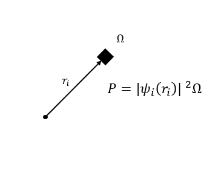

我第一次听到Hartree Fock这个名词是在大一的实验课上，那节课上计算化学实验，我们被要求用Gaussian算些简单的分子体系。大一的学生连基础的结构化学课都还没上过，别说计算软件和计算方法，连波函数、分子轨道都是闻所未闻。熬完实验课的唯一方法就是照猫画虎，紧跟着老师在Gaussian上点来点去，享受基组、泛函、Hartree Fock等不知所云的语汇强健我的大脑。

大一新生确证自己大学生身份的最佳实践不是好好上课、好好写作业，而是背地里喷老师水平低、骂课程编排差。于是很快，这次实验的实验报告就跟着班级群里对实验口诛笔伐的聊天记录一起被扔进了回收站里。虽然到在实验已经忘了大半，但我还记得我在实验报告里勉强诹出的几个结论，什么Hartree Fock方法算得速度很快，但是精度很低云云。

如今在量子化学中再学到Hartree Fock，当时囫囵写下的几条结论就忽地跳出来了。虽然我不认为这是实验编排良苦用心的结果，但这确实让我意识到，在学习某个知识前，率先建立对这条知识的纵观总览，对学习颇具裨益。所以，我要率先给出我对Hartree Fock方法的总体理解：

Hartree Fock方法是采用**中心场近似**的、解决**多电子体系**问题的、基于**变分原理**的薛定谔方程近似解方法。

---

类氢原子的薛定谔方程是方便解的，而如果体系中有超过一个电子，薛定谔方程就没法求解析解了，因为势能项中会含有 $1 / r_{ij}$ 的涉及两个电子的交互项。

$$
\sum_i - \frac{1}{2m_e} \nabla_i^2 \psi + \sum_A \sum_i - \frac{Z_A}{r_{iA}}\psi + \frac{1}{2} \sum_i \sum_j \frac{1}{r_{ij}}\psi = E \psi 
$$

Hartree提出，应该认为每个电子是在由原子核和其他电子组成的电场中**近似独立运动**的。这意味着，每个电子的波函数是**可分离变量**的。也就是说，总波函数可以写成每个电子波函数的乘积：

$$
\Psi = \psi_1 \psi_2 \psi_3 \cdots \psi_N
$$

注意如果每个单电子波函数 $\psi_i$ 是一个三元函数 $\psi_i(r_i)$，那么总波函数就是一个3n元的函数。

$$
\Psi(r_1, r_2, \cdots, r_n) = \psi_1(r_1) \psi_2(r_2) \cdots \psi_N(r_N)
$$

基于此，Hartree建立了Hartree方程，希望用其他电子对某一电子的平均作用势能代替交互项，从而写出每个单电子的方程，也就是

$$
\hat{h}_i \psi_i + \hat{\nu_i} \psi_i = \epsilon_i \psi_i
$$

其中，$\hat{h}_i$ 是单电子动能和核势能算符，对应着薛定谔方程中的前两项；而 $\hat{\nu_i}$ 则是其他电子对这个电子的势能项，是对薛定谔方程中后一项的近似。前者很容易给出表达式：

$$
\hat{h}_i = -\frac{1}{2m_e} \nabla^2 + \sum_A -\frac{Z_A}{r_{iA}}
$$

而在后一项中，我们需要考虑每个电子形成的“平均场”如何对其他电子产生电势作用。考虑一电子i具有波函数 $\psi_i$，在某个坐标为 $r_i$ 的空间微元 $\Omega$ 中，电子出现在此处的概率 $P = \left| \psi_i (r_i) \right|^2 \Omega$ 。而在此处，电子i对另一电子j形成的电势能则为

$$
\frac{1}{r_{ij}} \left| \psi_i (r_i) \right|^2 \Omega
$$

因而在整个空间内的平均场势能则为

$$
J_{ji} = \sum_\Omega \frac{1}{r_{ij}} \left| \psi_i (r_i) \right|^2 \Omega = \int \frac{1}{r_{ij}} \psi_i^*(r_i) \psi_i(r_i) dr_i
$$

而所有电子对电子j作用的势能之和的算符就是

$$
\hat{\nu_j} = \sum_i J_{ij} = \sum_i \int \frac{1}{r_{ij}} \psi_i^*(r_i) \psi_i(r_i) dr_i
$$

这样就给出了Hartree方程。然而为Hartree所不知的是，多电子体系的波函数具有另一些神奇的性质，因而导致了Hartree方程里某些假设出现了问题。