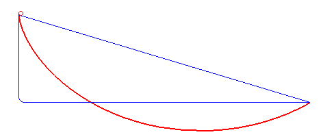

约翰·伯努利感到他素有的好奇心不断鼓动着他，当他注意到一个小球沿着不同的路径，从相同的起点滚动到相同的终点，需要的时间是不一样的。更奇怪的是，小球滚动的时间居然和它走过的路径长度不成正比：从平直斜面上滚下来的小球，竟然是三条曲线中耗时最长的那一个，尽管它的路径长度是最短的。

究竟沿着怎样的曲线，小球才能以最短的时间，从固定的起点到达固定的终点呢？在花了两个星期解决这个问题之后，他向全世界的数学家发起挑战，回应他的是他的老师莱布尼兹、他的哥哥雅可比·伯努利、牛顿爵士、奇恩豪斯和洛必达，他们都给出了“**摆线**”这一答案。

经历过高考数学洗礼的同学应该记得这个名字。摆线由下面这个参数方程给出：

$$
x = r(t-\sin t) \\
y = r(1 - \cos t)
$$

这场挑战远没有就此结束。20年后，欧拉提出了变分法来解决这一问题，这个方法极大地影响了后世的数学家和物理学家，包括Fock和Slater。

考虑小球起点和终点分别为 $(0, 0)$ 和 $(x_0, y_0)$，由机械能守恒，在运动途中任意一点有

$$
\frac{1}{2} mv^2 = mgy, v = \sqrt{2gy}
$$

而

$$
v = \frac{\mathrm{d}s}{\mathrm{d}t} = \frac{\sqrt{(\mathrm{d}x)^2 + (\mathrm{d}y)^2}}{dt} = \frac{dx\sqrt{1+y'^2}}{dt}
$$

也就是

$$
\sqrt{2gy} = \mathrm{d}x \frac{\sqrt{1+y'^2}}{dt} \\
dt = \sqrt{\frac{1+y'^2}{2gy}} \mathrm{d}x
$$

两边积分得到

$$
t = \int_0^{x_0} \sqrt{\frac{1+y'^2}{2gy}} \mathrm{d}x
$$

这样，$t$ 就是一个由 $y$ 决定的函数，而 $y$ 又是一个由 $x$ 决定的函数，$t$ 就是一个函数的函数，称为**泛函**。我们希望做的事情是，找到一个函数 $y$，使泛函 $t$ 取到最小值。

不失一般性地，考虑一个一般的函数 $F(x, y, y')$ 和对应的泛函 $I = \int_a^b F(x, y, y')$ 。为了找到目标函数 $y$，不妨考虑两点间的任一函数

$$
\widetilde{y} = y + \epsilon \eta(x)
$$

对满足 $\eta(a) = \eta(b) = 0$ 的给定函数 $\eta(x)$ ，可以通过 $\epsilon$ 取值的不同来得到其他函数，而最后得到的目标函数 $y$ 应当是与 $\epsilon$ 和 $\eta$ 无关的。这样，$I$ 就是一个仅仅关于 $\epsilon$ 的函数。

因此，为了求 $I$ 的极值，就是要求 $I(\epsilon)$ 的极值，也就是求其一阶导数的零点。于是，只要求出使 $I$ 的**一阶变分** $\delta I = \frac{\mathrm{d}I}{\mathrm{d} \epsilon} \epsilon = 0$ 的y就可以了。

然后Eular同学进行了一系列计算，得到了Eular-Lagrange方程：

$$
\frac{\partial F}{\partial y} - \frac{\mathrm{d}}{\mathrm{d}x} \frac{\partial F}{\partial y'} = 0, (x_1 < x < x_2)
$$

只要解这个方程就可以解出最速降线的表达式了，嗯嗯，真简单呢。

总的来说，变分法为人们提供了这样一种视角：要求某个泛函的极值，就要像求一个函数极值那样，**求泛函的变分等于0的点**，在那一点给出的函数表达式就是目标函数。这启发了Fock和Slater，让他们最终推导出了Hartree Fock方程。