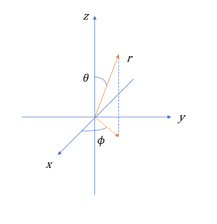

我们构建这样一个球坐标变换：

$$
x = r\sin \theta \cos \phi \\
y = r\sin \theta \sin \phi \\
z = r\cos \theta
$$

同时

$$
r = \sqrt{x^2 + y^2 + z^2} \\
\theta = \arctan \left(\frac{\sqrt{x^2+y^2}}{z}\right) \\
\phi = \arctan \left(\frac{y}{x}\right)
$$

那么势能项就变成了

$$
\hat{V} = \frac{Ze^2}{4\pi \epsilon r} \tag{1.6}
$$

已经变得非常简单了！接下来是动能项：

$$
\hat{T} = - \frac{\hbar^2}{2m} \nabla^2
$$

主要问题在于拉普拉斯算符如何变换到球坐标下。当然我们可以直接分别计算 $\frac{\partial }{\partial x}$, $\frac{\partial }{\partial y}$, $\frac{\partial }{\partial z}$ 与 $\frac{\partial }{\partial r}$, $\frac{\partial }{\partial \theta}$, $\frac{\partial }{\partial \phi}$ 的关系并暴算拉普拉斯算符的表达式，但我们可以采用一种更方便的方法。

> 以下一部分内容的计算细节会比较模糊，因为实际上这只是一个形式化的构造过程，真实的推导过程需要读者具有微分几何的知识，而笔者写作时并不对化学/材料学生期待如此高的数理基础。

以防万一，我们先计算所有 $x,y,z$ 对 $r, \theta, \phi$ 的偏导

$$
\begin{aligned}
& \frac{\partial x}{\partial r} = \sin \theta \cos \phi && \frac{\partial x}{\partial \theta} = r \cos \theta \cos \phi && \frac{\partial x}{\partial \phi} = -r \sin \theta \sin \phi & \\
& \frac{\partial y}{\partial r} = \sin \theta \sin \phi && \frac{\partial y}{\partial \theta} = r \cos \theta \sin \phi && \frac{\partial y}{\partial \phi} = r \sin \theta \cos \phi & \\
& \frac{\partial z}{\partial r} = \cos \theta && \frac{\partial z}{\partial \theta} = -r \sin \theta  && \frac{\partial z}{\partial \phi} = 0 &
\end{aligned}
$$

和所有 $r, \theta, \phi$ 对 $x, y, z$ 的偏导

$$
\begin{aligned}
& \frac{\partial r}{\partial x} = \sin \theta \cos \phi && \frac{\partial r}{\partial y} = \sin \theta \sin \phi && \frac{\partial r}{\partial z} = \sin \phi \\
& \frac{\partial \theta}{\partial x} = \frac{\cos \theta \cos \phi}{r} && \frac{\partial \theta}{\partial y} = \frac{\cos \theta \sin \phi}{r} && \frac{\partial \theta}{\partial z} = - \frac{\sin \theta}{r} \\
& \frac{\partial \phi}{\partial x} = - \frac{\sin \phi}{r \sin \theta} && \frac{\partial \phi}{\partial y} = \frac{\cos \phi}{r \sin \theta} && \frac{\partial \theta}{\partial z} = 0
\end{aligned}
$$

容易发现，

$$
\frac{\partial (r, \theta, \phi)}{\partial (x, y, z)} = 
\mathbf{C}^2 \cdot \left( \frac{\partial (x, y, z)}{\partial (r, \theta, \phi)} \right)^T, \mathbf{C} = \operatorname{diag}\{1, \frac{1}{r}, \frac{1}{r\sin \theta}\}
$$

众所周知 $(\partial(r, \theta, \phi) / \partial(x, y, z))^{-1} = \partial(x, y, z) / \partial(r, \theta, \phi)$ ，所以这玩意看起来很像一个单位正交阵。我们不妨令

$$
\mathbf{A} = \frac{\partial (x, y, z)}{\partial (r, \theta, \phi)} \cdot \mathbf{C} = \begin{bmatrix}
    \sin \theta \cos \phi & \cos \theta \cos \phi & -\sin \phi \\
    \sin \theta \sin \phi & \cos \theta \sin \phi & \cos \phi \\
    \cos \theta & -\sin \theta & 0
\end{bmatrix}
$$

则有

$$
\mathbf{A}^T = \mathbf{A}^{-1} = \mathbf{C}^{-1} \frac{\partial (r, \theta, \phi)}{\partial (x, y, z)}
$$

因此 $\mathbf{A}$ 是正交归一的。接下来我们将证明，其恰好是直角坐标系和球坐标系的基组的变换矩阵。

考虑一向量

$$
\boldsymbol{v} = [v_x, v_y, v_z]^T = v_x \boldsymbol{e_x} + v_y \boldsymbol{e_y} + v_z \boldsymbol{e_z}
$$

其微分

$$
\begin{aligned}
d \boldsymbol{v} = & \boldsymbol{e_x} dv_x +  \boldsymbol{e_y} d v_y + \boldsymbol{e_z} dv_z \\
= & 
\begin{bmatrix}
    \boldsymbol{e_x} & \boldsymbol{e_y} & \boldsymbol{e_z} 
\end{bmatrix} \cdot 
\begin{bmatrix}
    \partial_x \\
    \partial_y \\
    \partial_z
\end{bmatrix} \cdot
\begin{bmatrix}
    v_x & v_y & v_z
\end{bmatrix} \cdot
\begin{bmatrix} 
    dx \\
    dy \\
    dz
\end{bmatrix}
\\
= & 
\begin{bmatrix}
    \boldsymbol{e_x} & \boldsymbol{e_y} & \boldsymbol{e_z} 
\end{bmatrix} \cdot \left(
\frac{\partial r, \theta, \phi}{\partial x, y, z} \right)^T \cdot
\begin{bmatrix}
    \partial_r \\
    \partial_\theta \\
    \partial_\phi
\end{bmatrix} \cdot
\begin{bmatrix}
    v_r & v_\theta & v_\phi
\end{bmatrix} \cdot
\begin{bmatrix} 
    dr \\
    d\theta \\
    d\phi
\end{bmatrix} \\
= & \begin{bmatrix}
    \boldsymbol{e_x} & \boldsymbol{e_y} & \boldsymbol{e_z} 
\end{bmatrix} \cdot \mathbf{A} \cdot \mathbf{C} \cdot 
\begin{bmatrix}
    \partial_r \\
    \partial_\theta \\
    \partial_\phi
\end{bmatrix} \cdot
\begin{bmatrix}
    v_r & v_\theta & v_\phi
\end{bmatrix} \cdot
\begin{bmatrix} 
    dr \\
    d\theta \\
    d\phi
\end{bmatrix}
\end{aligned}
$$

其中 $\boldsymbol{e_x}, \boldsymbol{e_y}, \boldsymbol{e_z}$ 分别为 $x,y,z$ 方向的基矢。事实上，可以在球坐标系中构建基矢 $\boldsymbol{e_r}', \boldsymbol{e_\theta}', \boldsymbol{e_\phi}'$ （也许它们不是归一的，但一定是正交的，因为 $\partial(r, \theta, \phi) / \partial(x, y, z)$ 是正交的）。如果用球坐标基矢表示

$$
\boldsymbol{v} = v_r \boldsymbol{e_r}'  + v_\theta \boldsymbol{e_\theta}' + v_\phi \boldsymbol{e_\phi}'
$$

其微分则为

$$
\begin{aligned}
d \boldsymbol{v} = & \boldsymbol{e_r}' dv_r +  \boldsymbol{e_\theta}' dv_\theta +  \boldsymbol{e_\phi}' dv_\phi \\
= & 
\begin{bmatrix}
    \boldsymbol{e_r}' & \boldsymbol{e_\theta}' & \boldsymbol{e_\phi}'
\end{bmatrix} \cdot
\frac{\partial \boldsymbol{v}}{\partial (r, \theta, \phi)} \cdot
\begin{bmatrix}
    dr \\
    d \theta \\
    d \phi
\end{bmatrix} 
\end{aligned}
$$

丝毫不惊奇地，我们发现他俩长得很像，于是有

$$
\begin{bmatrix}
    \boldsymbol{e_x} & \boldsymbol{e_y} & \boldsymbol{e_z}
\end{bmatrix} \cdot \mathbf{A} \cdot \mathbf{C} = 
\begin{bmatrix}
    \boldsymbol{e_r}' & \boldsymbol{e_\theta}' & \boldsymbol{e_\phi}'
\end{bmatrix} 
$$

恰好 $\mathbf{A}$ 是单位正交阵，所以我们可以取

$$
\boldsymbol{e_r} = \boldsymbol{e_r}' \\
\boldsymbol{e_\theta} = \boldsymbol{e_\theta}' / r \\
\boldsymbol{e_\phi} = \boldsymbol{e_\phi}' / r\sin \theta
$$

于是就有

$$
\begin{bmatrix}
    \boldsymbol{e_x} & \boldsymbol{e_y} & \boldsymbol{e_z}
\end{bmatrix} \cdot
\begin{bmatrix}
    \sin \theta \cos \phi & \cos \theta \cos \phi & -\sin \phi \\
    \sin \theta \sin \phi & \cos \theta \sin \phi & \cos \phi \\
    \cos \theta & -\sin \theta & 0
\end{bmatrix}  = 
\begin{bmatrix}
    \boldsymbol{e_r} & \boldsymbol{e_\theta} & \boldsymbol{e_\phi}
\end{bmatrix} 
$$

这样，我们构造了球坐标系中的一组基矢。
